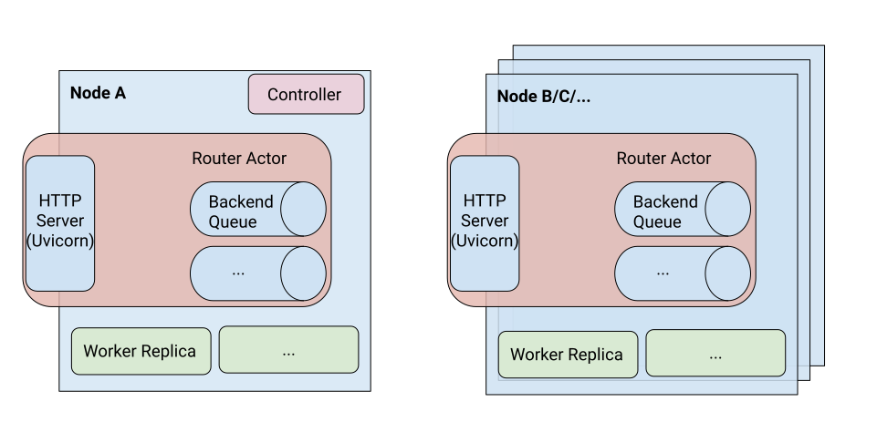

# Ray Serve

[Ray Serve](https://mlserver.readthedocs.io/en/latest/) is a framework agnostic, giving an end to end control over the API while delivering scalability and high performance. You can develop Ray Serve on your laptop, deploy it on a dev box, and scale it out to multiple machines or K8s cluster without changing one lines of code.

<p align="center">

</p>

Serve runs on Ray and utilizes [Ray actors](https://docs.ray.io/en/latest/ray-core/actors.html#actor-guide).

There are three kinds of actors that are created to make up a Serve instance:

* Controller: A global actor unique to each Serve instance that manages the control plane. The Controller is responsible for creating, updating, and destroying other actors. Serve API calls like creating or getting a deployment make remote calls to the Controller.

* Router: There is one router per node. Each router is a Uvicorn HTTP server that accepts incoming requests, forwards them to replicas, and responds once they are completed.

* Worker Replica: Worker replicas actually execute the code in response to a request. For example, they may contain an instantiation of an ML model. Each replica processes individual requests from the routers (they may be batched by the replica using @serve.batch, see the [batching](https://docs.ray.io/en/latest/serve/ml-models.html#serve-batching) docs).

In this exercise, we will deploy the sentiment analysis huggingface transformer model using Ray Serve so it can be scaled up and queried over HTTP using two approaches.

## Ray Serve Deployment

### Approach 1

Using ray serve

```python
import ray
from ray import serve

from sentiment.model import SentimentBertModel

# connect to Ray cluster
ray.init(address="auto", namespace="serve")
# start ray serve runtime
serve.start(detached=True)

def sentiment_classifier(text: str):
    classifier = SentimentBertModel()
    return classifier.predict(text)

# add the decorator @serve.deployment to the router function to turn the function into a Serve Deployment object.
@serve.deployment
# input : Starlette request object
def router(request):
    txt = request.query_params["txt"]
    return sentiment_classifier(txt)

# deploy the router deployment object to the ray serve runtime
router.deploy()
```

* `ray.init()`: connects to or starts a single-node Ray cluster on your local machine, which allows you to use all your CPU cores to serve requests in parallel
* `serve.start()`: start Ray Serve runtime
* `@serve.deployment`: `@serve.deployment` makes `router` function a `Deployment` object. If you want the function name to be different than the name in the HTTP request, you can add the `name` keyword parameter to the `@serve.deployment` decorator to specify the name sent in the HTTP request.

### Approach 2

Ray Serve with FastAPI. Using FastAPI, we can add more complex HTTP handling logic along with cool features such as variable routes, automatic type validation, dependency injection, [etc](https://fastapi.tiangolo.com/).

```python
import ray
from ray import serve

from fastapi import FastAPI
from fastapi import Query
from starlette.responses import JSONResponse

from sentiment.model import SentimentBertModel

app = FastAPI()
ray.init(address="auto", namespace="classifier")
serve.start(detached=True)

@serve.deployment(route_prefix="/")
@serve.ingress(app)
class Classifier:
    def __init__(self) -> None:
        self.classifier = SentimentBertModel(
            "distilbert-base-uncased-finetuned-sst-2-english"
        )

    @app.get("/test")
    def root(self):
        return "Sentiment Classifier (0 -> Negative and 1 -> Positive)"

    @app.get("/healthcheck", status_code=200)
    def healthcheck(self):
        return "dummy check! Classifier is all ready to go!"

    @app.post("/classify")
    async def predict_sentiment(self, input_text: str = Query(..., min_length=2)):
        out_dict = self.classifier.predict(input_text)
        return JSONResponse(out_dict)

Classifier.deploy()
```

## Run

### Locally

Test the sentiment classifier model

```bash
docker build -t sentiment -f sentiment/Dockerfile.sentiment sentiment/
docker run --rm -it sentiment
```

Test Ray Serve Deployment locally

> Note:  Replace `<shm-size>` with a limit appropriate for your system, for example 512M or 2G. A good estimate for this is to use roughly 30% of your available memory (this is what Ray uses internally for its Object Store).

```bash
docker build -t rayserve .
docker run --shm-size=2G -p 8000:8000 -p 8265:8265 -it --rm rayserve
```

Inside docker container,

```bash
ray start --head --dashboard-host=0.0.0.0
python3 serve_with_rayserve.py
```

> [127.0.0.1:8265](127.0.0.1:8265) to access ray dashboard.

We can now test our model over HTTP. The structure of our HTTP query is:

```bash
http://127.0.0.1:8000/[Deployment Name]?[Parameter Name-1]=[Parameter Value-1]&[Parameter Name-2]=[Parameter Value-2]&...&[Parameter Name-n]=[Parameter Value-n]
```

The `127.0.0.1:8000` refers to a localhost with port `8000`. The `[Deployment Name]` is `router` in our case, it refers to either the name of the function that we called `.deploy()` on or the name keyword parameter’s value in `@serve.deployment`.

Each `[Parameter Name]` refers to a field’s name in the request’s `query_params` dictionary for our deployed function. In our example, the only parameter we need to pass in is `txt`. This parameter is referenced in the `txt = request.query_params["txt"]` line in the router function. Each `[Parameter Name]` object has a corresponding `[Parameter Value]` object. The txt’s `[Parameter Value]` is a string containing the article text to summarize. We can chain together any number of the name-value pairs using the `&` symbol in the request URL.

```bash
# test inference request
python3 test_local_http_endpoint.py
```

First request takes time (~ 100 secs) as model needs to be downloaded.

Alternatively querying using `httpie`

```bash
python -m pip install httpie
http GET 127.0.0.1:8000/router txt==ilikeyou
```

To stop the ray cluster.

```bash
ray stop
```

Inside same docker container,

Test using FastAPI and Ray Serve

```bash
ray start --head --dashboard-host=0.0.0.0
python3 serve_with_fastapi.py
http GET 127.0.0.1:8000/test
http GET 127.0.0.1:8000/healthcheck
http POST 127.0.0.1:8000/classify?input_text=ilikeyou
http POST 127.0.0.1:8000/classify?input_text=i
ray stop
```

Further Readings:

* [Batching Inference](https://docs.ray.io/en/latest/serve/tutorials/batch.html)
* [Multiple Models Inferencce](https://docs.ray.io/en/latest/serve/ml-models.html#id3)
* [Deploying on Kubernetes](https://docs.ray.io/en/latest/serve/deployment.html#deploying-on-kubernetes)
* [Autoscaling](https://docs.ray.io/en/latest/serve/core-apis.html#configuring-a-deployment)
